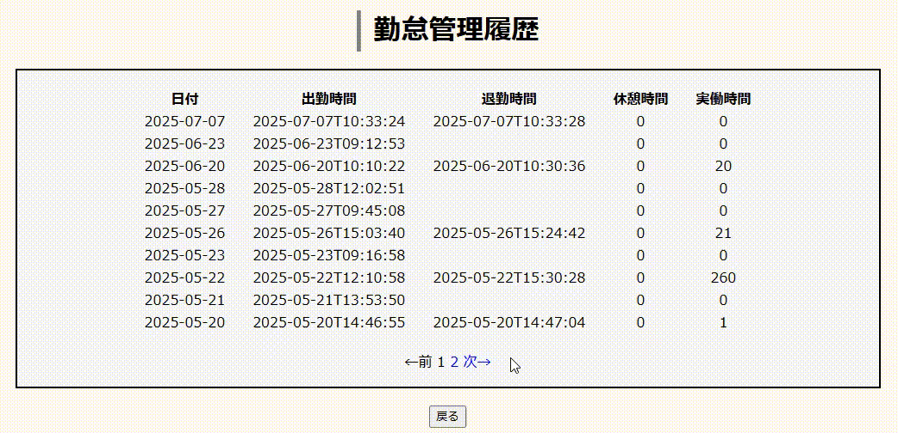

## はじめに
これは社内ポータルとして使うことを想定したWebアプリケーションです。 
チャット、勤怠管理アプリを組み込んであります。

アプリURL 
https://portal-oc33.onrender.com
  
『Webサイトのログイン情報』 
- 管理者 
  USERNAME：admin 
  PASSWORD：11111

- 一般ユーザー 
  USERNAME：user01 
  PASSWORD：11111  
※ ユーザーを追加することは可能です（管理者権限）

## コンセプト
- springとmysqlの基礎を習得するためにデータベース連携したWebアプリケーションを作成する。
- 作成したアプリケーションをデプロイするところまで目指す。

## 仕様
**チャットアプリ**
- WebSocketを利用したリアルタイム通信
- 未読メッセージの件数をユーザー毎に表示
- チャット内で既読メッセージと未読メッセージの境目にラインを引いて『ここから未読メッセージ』と表示
- データベースに登録された全ユーザーが参加する全体チャットを実装

**勤怠管理アプリ**
- 出勤・退勤ボタンでそれぞれ出勤時間・退勤時間を記録
- 申請ボタンから遅刻早退などの申請、休暇申請が可能
- 履歴ボタンで過去の勤怠履歴を表示

**管理者権限**
- ユーザーの新規登録
- ユーザーの削除
- パスワードリセット（仮パスワードの発行）
- 各種申請の閲覧、承認
- ユーザーのステータス登録

## デモGIF
- **チャット** 

- **勤怠管理**  
  - 出退勤  
    
  - 勤怠管理履歴  
    
  - 申請  
    

## 使用技術
- **言語**：Java 17, HTML, CSS, javascript
- **フレームワーク**：spring boot 3.4.5
- **IDE**：eclipse 2023-12(4.30.0)
- **DB**：mysql
- **デプロイ**：Render, railway
- spring-boot-starter-security
- WebSocket
- Thymeleaf
- Validation
- Pageable

## おわりに
今回のWebアプリ製作でMVCモデル、データベース連携の基礎を習得できた。 
アプリケーションのファイルとデータベースを別々のサイトでデプロイしたため連携作業に時間がかかった。 

製作期間：１カ月半
